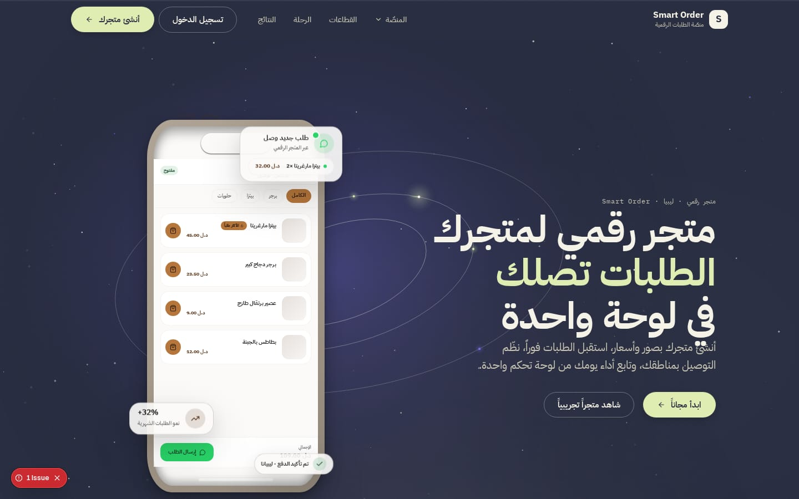
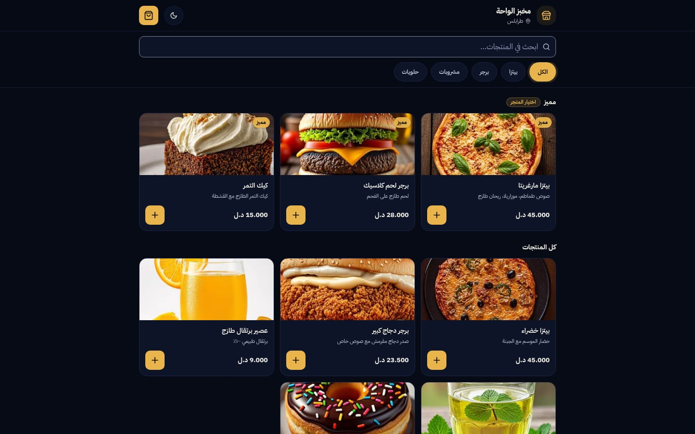
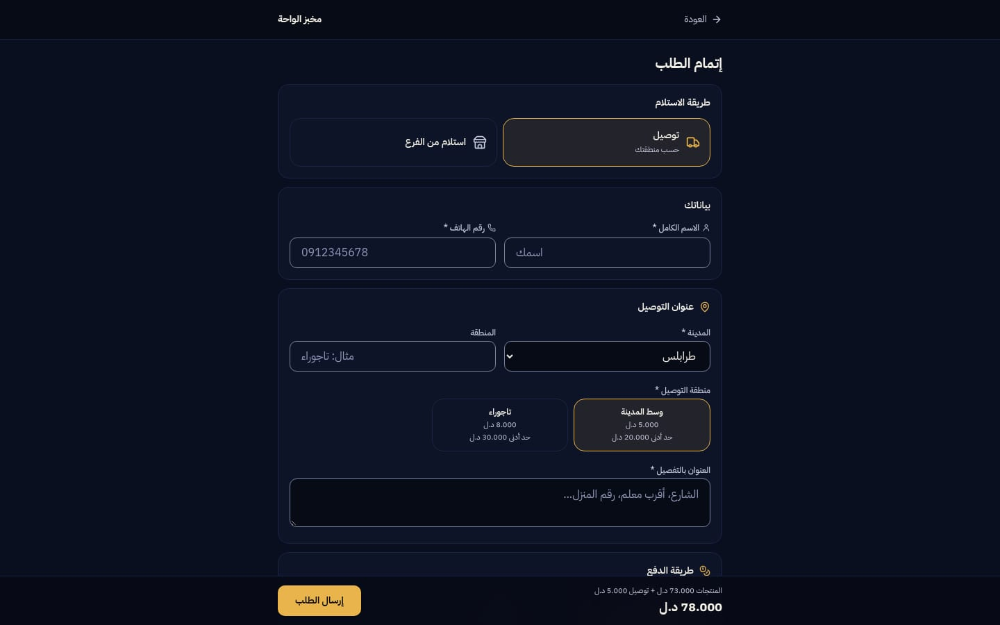
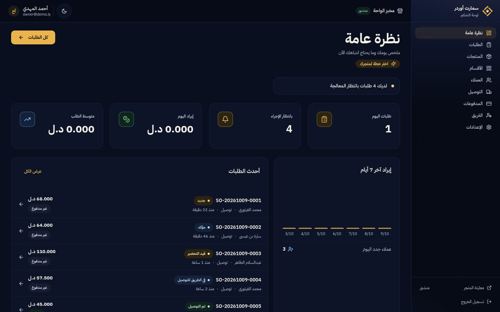

# 🛍️ سمارت أوردر | Smart Order

**Digital storefront, orders & delivery for businesses — an Arabic-first RTL SaaS on Next.js 16.**

> 🌐 **العربية** · [English](./README.en.md)

**منصة الطلبات الرقمية للأعمال في ليبيا** — أي عمل يُطلق متجره الرقمي الاحترافي في دقائق: واجهة متجر عامة جاهزة للمسح بـ QR بسلة ودفع، محرّك طلبات بحالات موثّقة، توصيل بمناطق ورسوم، مدفوعات محلية، وتأكيدات واتساب، ولوحة تحكم كاملة لصاحب العمل.

> **الإنتاج:** <https://order.smart-link.ly> · Next.js 16 · PostgreSQL (Neon) · Vercel

[](https://github.com/ahmadmedo1012/Smart-Order/actions/workflows/ci.yml)
[](https://order.smart-link.ly)
[](./LICENSE)

---

## 🖼 نظرة سريعة

| الوضع النهاري ☀️ | الوضع الليلي 🌙 |
|:---:|:---:|
| [](docs/screenshots/hero-light.jpg) | [](docs/screenshots/hero-dark.jpg) |

> مزيد من اللقطات (المتجر، إتمام الطلب، لوحة التحكم) في قسم «لقطات الشاشة» أدناه — والتعليقات الكاملة والمقاسات في [`docs/screenshots/README.md`](docs/screenshots/README.md).

---

## 🧭 ما هو سمارت أوردر؟

**Smart Order** يتيح لأي عمل ليبي إطلاق متجر طلبات رقمي كامل بدون كود أو وسيط:

- **متجر عام جاهز لـ QR** — رابط عام لكل عمل (`/store/[slug]`) يُصيَّر من الخادم (SSR) فيظهر المنتجات في أول إطار عند مسح الرمز، مع أقسام وبحث ومشتقات (مقاسات وإضافات).
- **سلة وإتمام طلب** — سلة عميل كاملة بصفحة إتمام طلب: بيانات التواصل، العنوان، مناطق التوصيل بالرسوم والحد الأدنى (تُفرض من الخادم)، وطرق دفع محلية.
- **محرّك طلبات موثّق** — آلة حالات مُتحقَّقة (NEW → CONFIRMED → PREPARING → READY → OUT_FOR_DELIVERY → DELIVERED / CANCELLED / REJECTED)، أرقام طلبات عامة (`SO-20260917-0042`)، سجل تدقيق كامل، وصفحة تتبّع عامة للزبون برمز غير قابل للتخمين.
- **مدفوعات ليبية** — نقدًا / عند التوصيل / تحويل مدار / تحويل ليبيانا، مع تأكيد يدوي من المتجر (لا نجاح زائف من أي بوابة).
- **واتساب أولًا** — رسائل طلب مهيكلة عبر روابط `wa.me` للزبون ولصاحب العمل بعد كل طلب.
- **لوحة تحكم للمالك** — إحصائيات اليوم وتنبيهات قابلة للتنفيذ، الطلبات بفلاتر وبحث، وإدارة المنتجات والأقسام والعملاء والتوصيل والمدفوعات والموظفين — كل شيء بالعربية RTL على هوية مدارك.

---

## ✨ المميزات

- 🛍️ **واجهة المتجر** — منيو عام بأقسام، بحث فوري، مشتقات منتجات (مقاسات + مجموعات إضافات)، وتجربة عربية RTL أولًا.
- 🧾 **محرّك الطلبات** — آلة حالات مُتحققة من الخادم، أرقام عامة، تاريخ تدقيق لكل حالة، وصفحة تتبّع عامة بالرمز (`/track/[token]`).
- 🚚 **مناطق التوصيل** — رسوم وحد أدنى لكل منطقة، تُحسب وتُفرض من الخادم عند إتمام الطلب (لا يُعتمد أي شيء من العميل).
- 💳 **مدفوعات محلية** — نقدي / عند التوصيل / مدار / ليبيانا، بمعمارية محايدة للمزوّد وتأكيد يدوي موثّق.
- 💬 **واتساب أولًا** — رسالة مهيكلة جاهزة بالطلب للزبون وللمتجر عبر `wa.me`.
- 📊 **لوحة التحكم** — إحصائيات اليوم، تنبيهات قابلة للتنفيذ، طلبات بفلاتر وبحث، وإدارة منتجات/أقسام/عملاء/توصيل/مدفوعات/موظفين.
- 🔐 **SaaS متعدد المستأجرين** — عزل صارم للمستأجرين، صلاحيات حسب الدور (OWNER / ADMIN / STAFF) مفروضة من الخادم.

---

## 🧰 التقنيات

- **Next.js 16** (App Router) + React 19 + TypeScript
- **Tailwind CSS 4** + shadcn/ui (Radix) — نظام تصميم مدارك: ليلي night/gold ونهاري cream/copper، بالوضعين.
- **Prisma ORM** — SQLite للتطوير المحلي، PostgreSQL (Neon) في الإنتاج.
- **مصادقة جلسات مخصصة** — PBKDF2-SHA512 بـ 600 ألف تكرار، رموز جلسات مُجزَّأة (hashed)، وكوكيز httpOnly.
- **الأموال** — درهم صحيح (millimes) في كل المسارات: 1 د.ل = 1000 درهم، بلا أي حساب فاصلة عائمة.
- **خطوط مستضافة ذاتيًا** — subsets من IBM Plex Sans Arabic (400–700، عربي + لاتيني) بموجب OFL — تكافؤ مدارك الحرفي، بلا أي طلبات خارجية.

---

## 🏗️ ملاحظات معمارية

- كل مسارات الأموال يُعاد تسعيرها من الخادم؛ الأسعار المرسلة من العميل تُهمَل.
- إنشاء الطلب idempotent بمفتاح من العميل — الإرسال المزدوج يُعيد نفس الطلب نفسه.
- عزل المستأجرين: كل استعلام مقيّد بـ `businessId` بعد التحقق من العضوية.
- الصور: تُتحقق بالبايت السحري، تُضغط في المتصفح، وتُخزَّن في قاعدة البيانات (تنجو من إعادة النشر — بلا اعتمادات تخزين خارجي).
- غلاف API موحّد `{ success, data, meta }` بأخطاء عربية للمستخدم — الدواخل لا تتسرب أبدًا.

---

## 🚀 البدء محليًا

> التثبيت عبر **bun** (`bun.lock` هو قفل المستودع — `npm install` يجرّ إصدارات لا يقبلها القفل).

```bash
git clone https://github.com/ahmadmedo1012/Smart-Order.git
cd Smart-Order
bun install --frozen-lockfile
cp .env.example .env          # اضبط DATABASE_URL (وضع SQLite الافتراضي يعمل فورًا)
bunx prisma db push           # إنشاء المخطط المحلي
bun run dev                   # http://localhost:3000
bun run build                 # بناء الإنتاج
```

### متغيرات البيئة

المصدر القانوني هو [`.env.example`](.env.example) — الجدول يعرض المجموعة المطلوبة:

| المتغير | الغرض |
|---|---|
| `DATABASE_URL` | قاعدة البيانات: ملف SQLite للتطوير (`file:…`) أو رابط PostgreSQL (Neon) للإنتاج |
| `NEXT_PUBLIC_SITE_URL` | الرابط القانوني للموقع (SEO / Open Graph / sitemap) — يجب أن يكون رابطًا حقيقيًا أو يُترك فارغًا |
| `GIT_COMMIT_SHA` | توثيق إصدار الخدمة في `/api/health` للنشر الذاتي (Vercel يحقنه تلقائيًا — لا يُختلق أبدًا؛ `null` إن غاب) |

---

## 📜 الأوامر

| الأمر | الوصف |
|---|---|
| `bun run dev` | خادم التطوير على المنفذ 3000 |
| `bun run build` | بناء إنتاج Vercel (`next build`) |
| `bun run build:selfhost` | بناء standalone للاستضافة الذاتية (ينسخ `static/` و`public/` داخل الحزمة) |
| `bun run start` | تشغيل نسخة الإنتاج محليًا |
| `bun run start:selfhost` | تشغيل حزمة standalone (`NODE_ENV=production`) |
| `bun run lint` | ESLint |
| `bun run test:parity` | اختبارات تكافؤ مدارك (الألوان، نصف القطر، الحركة، z-index، الارتفاعات + بوابات الاستهلاك) |
| `bun run test:e2e` | مجموعة E2E للـ API: المصادقة، عزل المستأجرين، دورة حياة الطلب، إعادة التسعير، حدود المعدل — تعمل ضد أي Base URL |
| `bun run db:push` | دفع مخطط Prisma إلى قاعدة البيانات (`--accept-data-loss`) |
| `bun run db:generate` | توليد عميل Prisma |
| `bun run db:migrate` | إنشاء/تطبيق ترحيلات للتطوير |
| `bun run db:reset` | تصفير قاعدة البيانات وإعادة الترحيل |

> أعداد الاختبارات تُوثَّق في [`CHANGELOG.md`](CHANGELOG.md) لكل جولة — لا تُثبَّت أرقام في هذا الملف (عقيدة هندسة التوثيق: لا أرقام تتقادم).

---

## 🧪 التشغيل ضد إنتاج حي

```bash
bun run dev                                  # ابدأ خادم التطوير
bun run test:parity                          # تكافؤ مدارك
node tests/e2e/api-e2e.js https://your-deployment.vercel.app   # E2E ضد أي نشر
```

---

## 🚢 النشر (Vercel + Neon PostgreSQL)

مسار الإنتاج الأساسي — نفس معمارية أشقائي في منظومة سمارت (سمارت منيو وسمارت بوت): **Vercel + Neon PostgreSQL**. `vercel.json` مضمّن، والمرجع الكامل (المتغيرات، قاعدة البيانات، النطاق `order.smart-link.ly`، قائمة ما بعد النشر) في [`DEPLOYMENT.md`](DEPLOYMENT.md).

```bash
vercel link
vercel env add DATABASE_URL production        # رابط Neon PostgreSQL
vercel env add NEXT_PUBLIC_SITE_URL production
DATABASE_URL="<neon-url>" bunx prisma db push --schema=prisma/schema.postgres.prisma
vercel --prod
```

> **ملاحظة vercel-db-sync:** أمر البناء الحقيقي (`vercel.json`) يشغّل `scripts/vercel-db-sync.mjs` قبل توليد Prisma وبناء Next — مزامنة مخطط مرنة من قاعدة الإنتاج (إصلاح تجميد النشر ثلاثة أسابيع، الالتزام `fdd57ff`).

البديل الذاتي: `bun run build:selfhost` + `start:selfhost` (standalone) — راجع DEPLOYMENT.md §5.

---

## 📁 هيكل المشروع

```
src/
  app/
    page.tsx                  # صفحة SaaS الرئيسية (الهيرو + الأقسام + الأسعار + FAQ)
    login/ register/          # المصادقة (معالج تسجيل متعدد الخطوات)
    dashboard/                # تطبيق العمل: نظرة عامة، الطلبات، المنتجات، الأقسام،
                              #   العملاء، التوصيل، المدفوعات، الموظفون، الإعدادات، التهيئة
    store/[slug]/             # المتجر العام + checkout
    track/[token]/            # التتبع العام للطلب
    api/                      # نقاط REST (مصادقة، CRUD للأعمال، مسار الطلب العام، الوسائط)
  components/  dashboard/ storefront/ shared/ ui/
  lib/         constants, auth, order-machine, money, phone, whatsapp, storage, api, …
prisma/        schema.prisma (SQLite للتطوير) + schema.postgres.prisma (PostgreSQL للإنتاج)
tests/         parity.mjs + e2e/api-e2e.js
```

---

## 🖼️ لقطات الشاشة

| المتجر العام «مخبز الواحة» (تجريبي) | إتمام الطلب |
|:---:|:---:|
| [](docs/screenshots/storefront.jpg) | [](docs/screenshots/checkout.jpg) |

| لوحة تحكم صاحب المتجر |
|:---:|
| [](docs/screenshots/dashboard.jpg) |

> التعليقات الكاملة والمقاسات في [`docs/screenshots/README.md`](docs/screenshots/README.md).

---

## 🛰️ جزء من منظومة مدارك — Part of the Madarek Ecosystem

> نظام تصميم واحد لكل المشاريع · هوية مدارك: ليلي night/gold `#070B16`/`#E9B44C` — نهاري cream/copper `#FBFAF9`/`#B57438` — خط IBM Plex Sans Arabic

| المشروع | الدور | GitHub | الموقع المباشر |
|---|---|---|---|
| 🎓 **مدارك / Madarek** | منصة التعليم الذكي لجامعة الزاوية — المرجع الأم لنظام التصميم | [github.com/ahmadmedo1012/madarek](https://github.com/ahmadmedo1012/madarek) | [madarek.onrender.com](https://madarek.onrender.com) |
| 🔗 **سمارت لينك / Smart-Link** | المظلة الرقمية للأعمال في ليبيا | [github.com/ahmadmedo1012/Smart-Link](https://github.com/ahmadmedo1012/Smart-Link) | [smart-link.ly](https://smart-link.ly) |
| 🍽️ **سمارت منيو / Smart-Menu** | منيو رقمي وطلبات واتساب للمطاعم | [github.com/ahmadmedo1012/Smart-Menu](https://github.com/ahmadmedo1012/Smart-Menu) | [menu.smart-link.ly](https://menu.smart-link.ly) |
| 🤖 **سمارت بوت / SmartBot** | بوت ماسنجر وأتمتة لصفحات فيسبوك | [github.com/ahmadmedo1012/SmartBot](https://github.com/ahmadmedo1012/SmartBot) | [bot.smart-link.ly](https://bot.smart-link.ly) |
| 🛍️ **سمارت أوردر / Smart-Order** | متجر رقمي وطلبات وتوصيل للأعمال | [github.com/ahmadmedo1012/Smart-Order](https://github.com/ahmadmedo1012/Smart-Order) | [order.smart-link.ly](https://order.smart-link.ly) |

## 📜 التراخيص والملكية

مشروع خاص — جميع الحقوق محفوظة © 2026 أحمد مدو (`ahmadmedo1012`). النص القانوني الكامل في ملف [`LICENSE`](LICENSE).

### الخطوط
العلامة الأساسية **IBM Plex Sans Arabic** (400–700، subsets عربي + لاتيني) مع IBM Plex Mono — self-hosted بلا أي طلبات خارجية، وكلاهما بموجب **رخصة SIL Open Font License 1.1**.
